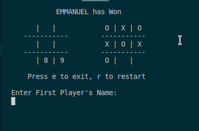
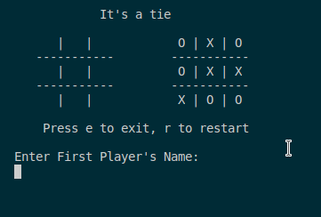

# Ruby Tic Tac Toe Milestone 4

In this project, we built a Tic Tac Toe game. The main goal is to put into practice the main concepts of Object Oriented Programming. Particularly, classes and access to their attributes.

## Built With

- Ruby-2.5.1p57

## Demo

### when there is a win

### when there is a tie

## Game Instructions

1.  The game is played on a grid that's 3 squares by 3 squares. the table on the left shows which of the cells are available and which numbers(1-9) to press; while the table on the right shows user input
2.  You are X, your friend is O. Players take turns putting their marks in empty squares.
3.  The first player to get 3 of her/his marks in a row (up, down, across, or diagonally) is the winner.
4.  When all 9 squares are full, the game is over. If no player has 3 marks in a row, the game ends in a tie.

## How to start game

1. From bin folder right click on the main file and select open with terminal option
2. Enter your and your oponent's name
3. Take turns and play the game as per the instructions provided

### How to install using Command line

    1. Click on the install or download button under the repository name and grab the url
    by clicking on the clipboard icon

    2.open your terminal

    3.Navigate to the location in your computer where you want the repo to be cloned

    4. Type git clone  and paste the url you copied on step one.

        $ git clone https://github.com/YOUR-USERNAME/YOUR-REPOSITORY

    5. Press Enter. Your local clone will be created.

                $ git clone https://github.com/YOUR-USERNAME/YOUR-REPOSITORY
                > Cloning into `Spoon-Knife`...
                > remote: Counting objects: 10, done.
                > remote: Compressing objects: 100% (8/8), done.
                > remove: Total 10 (delta 1), reused 10 (delta 1)
                > Unpacking objects: 100% (10/10), done.

## Authors

👤 **Author**

- Gmail: [Teshager Admasu](mailto:teshager8922@gmail.com)
- Github: [@teshager21](https://github.com/teshager21)
- Twitter: [@Teshage84907805](https://twitter.com/Teshage84907805)
- Linkedin: [Teshager Admasu](https://www.linkedin.com/in/teshager-admasu-0000011a2/)

👤 **Author**

- Github: [@githubhandle](https://github.com/chirchir12)
- Twitter: [@twitterhandle](https://twitter.com/shadochir)
- Linkedin: [linkedin](https://www.linkedin.com/in/emmanuel-chirchir/)
- Email: [email](chirchir7370@gmail.com)

## 🤝 Contributing

    Contributions, issues and feature requests are welcome!

Feel free to check the [issues page]().

## Show your support

Give a ⭐️ if you like this project!

## Acknowledgments

- [Microverse](https://www.microverse.org/)
- [Odin Project](https://www.theodinproject.com//)
- [Github](https://github.com/)

## 📝 License

This project is [MIT](lic.url) licensed.
